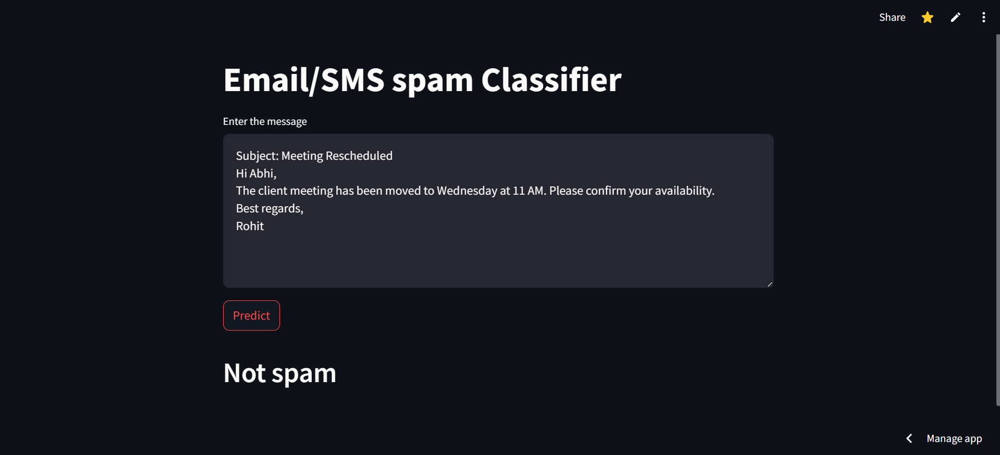
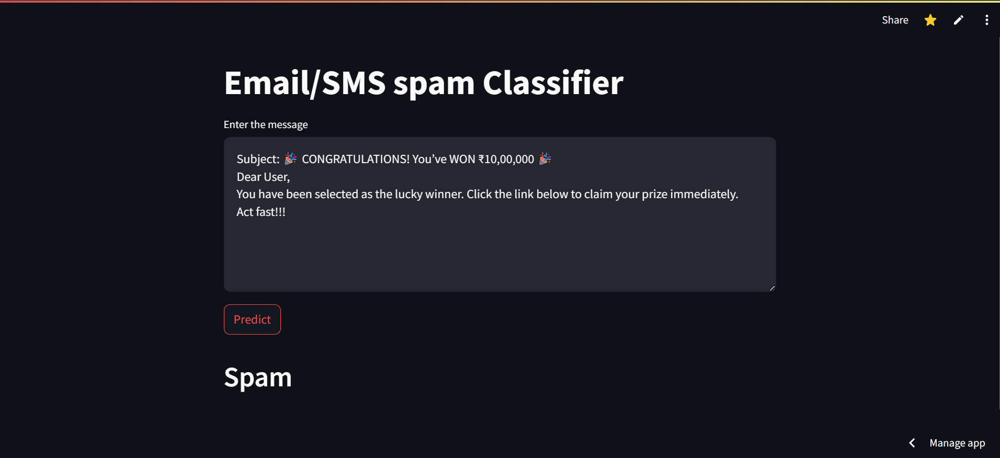

## Spam-classifier

  
 

This project is an Email/SMS Spam Classifier built using machine learning techniques. It helps in identifying and filtering out spam messages, ensuring that users receive only relevant and important communications. The classifier leverages Natural Language Processing (NLP) to preprocess and transform text data before making predictions using a trained Multinomial Naive bayes model.

#### Links

- [Streamlit App](https://email-checker.streamlit.app/)

